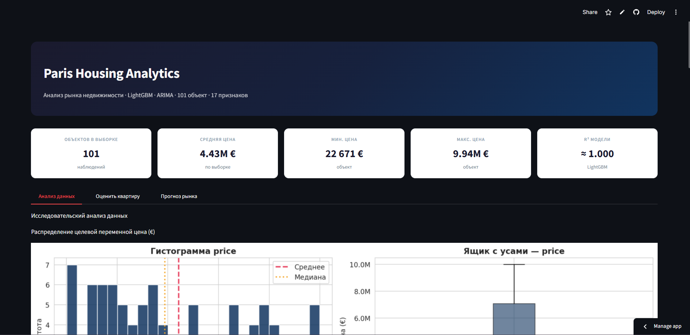
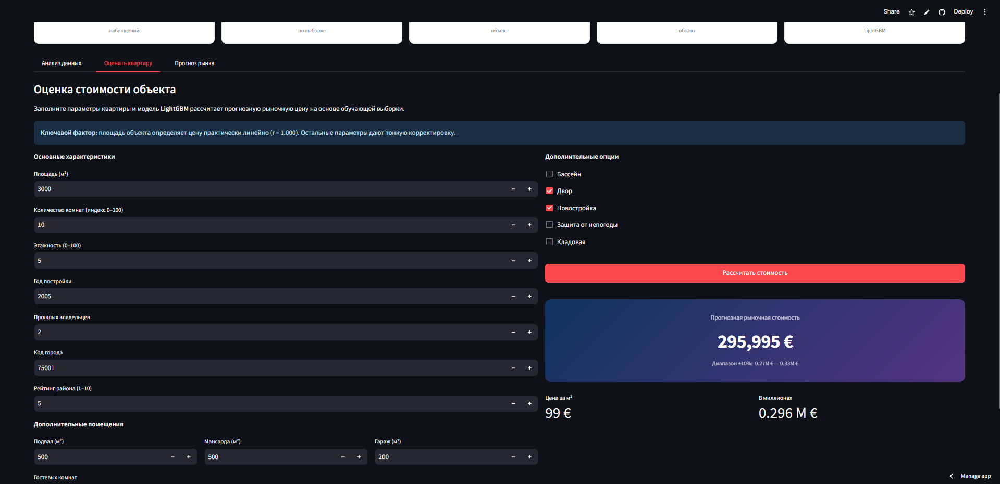
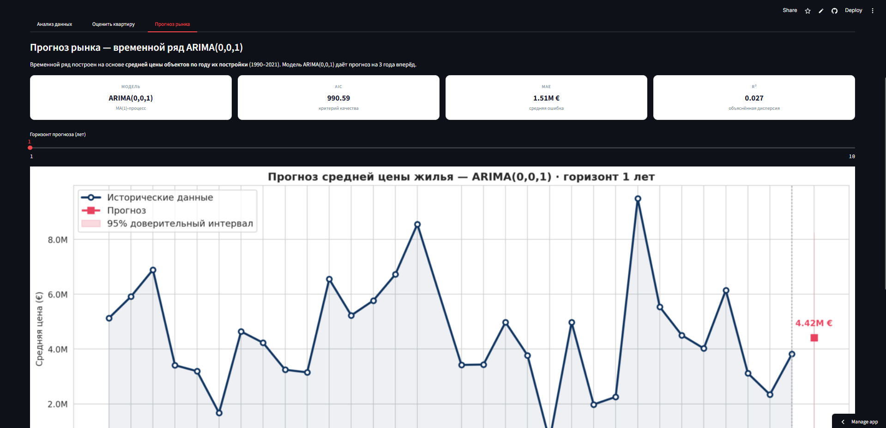

# Paris Real Estate Analysis 

[](https://paris-real-estate-analysis-wwbzfu7tjzprccitejmrsr.streamlit.app/)

Анализ рынка недвижимости Парижа и прогнозирование стоимости объектов с использованием алгоритмов машинного обучения и анализа временных рядов. 

Проект представляет собой полноценный пайплайн исследования данных: от разведочного анализа (EDA) в Google Colab до готового интерактивного веб-приложения на базе Streamlit.

## Бизнес-задачи проекта
1. **Оценка стоимости:** Прогнозирование рыночной цены квартиры на основе её характеристик с помощью алгоритма градиентного бустинга.
2. **Прогноз рынка:** Оценка динамики средних цен на недвижимость на 1–10 лет вперед в зависимости от года постройки здания. *(Временной ряд сгенерирован искусственно путем агрегации средних цен по годам постройки для демонстрации работы алгоритма).*

---

## Интерфейс приложения

### 1. Интерактивный дашборд и разведочный анализ (EDA)
Вкладка с общими метриками и графиками распределения цен, матрицей корреляций и зависимостями стоимости от параметров объекта.



### 2. Оценка стоимости квартиры (LightGBM)
Пользовательский калькулятор: при вводе параметров квартиры модель выдает прогнозную рыночную цену с расчетом диапазона ±10%.



### 3. Прогноз рынка (ARIMA)
Прогнозирование средних цен с помощью модели ARIMA(0,0,1) на заданный пользователем горизонт (от 1 до 10 лет) с отрисовкой доверительного интервала.



---

## Стек технологий
- **Анализ данных и ML:** Python, Pandas, NumPy, SciPy, Scikit-Learn, LightGBM, Statsmodels, Joblib
- **Визуализация:** Matplotlib, Seaborn
- **Веб-интерфейс:** Streamlit

## Структура репозитория
- `assets/` — cкриншоты для формирования readme.
- `research/` — `.ipynb` с полным циклом исследования данных, обучением моделей и оценкой вклада переменных.
- `data/` — наборы данных:
  - `ParisHousing_clean.csv` — основной очищенный датасет.
  - `time_series.csv` — агрегированные данные для временного ряда.
- `models/` — сериализованные артефакты:
  - `lightgbm_model.pkl` — обученная модель LightGBM.
  - `feature_cols.pkl` — список признаков для корректной работы модели.
- `app.py` — исходный код веб-приложения на Streamlit.
- `requirements.txt` — зависимости проекта.

## Установка и запуск локально

1. Склонируйте репозиторий:
   ```bash
   git clone [https://github.com/ВАШ_NICKNAME/paris-real-estate-analysis.git](https://github.com/ВАШ_NICKNAME/paris-real-estate-analysis.git)
   cd paris-real-estate-analysis

2. Установите зависимости:
   ```bash
   pip install -r requirements.txt

3. Запустите приложение:
   ```bash
   streamlit run app.py